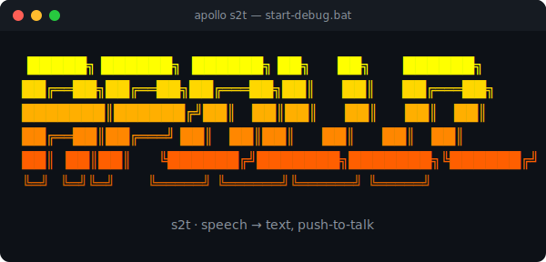

# Apollo s2t

<p align="center">
  
</p>

<p align="center">
  
  
  
  
</p>

A small **Windows** background tool for push-to-talk speech-to-text dictation.

**Hold a key → speak → release → the text lands in your active text field**
(ChatGPT, Claude, Word, browser, VS Code, WhatsApp Web, …).

| Key (default) | Function |
|---------------|----------|
| **F8** | Plain dictation — the whole recording is inserted as one coherent text on release |
| **F9** | Dictation + **polish** (an LLM cleans up grammar, fillers, slips) |
| **F10** | Dictation + **structure as a prompt** (an LLM turns it into a clean, project-aware prompt) |

All three hotkeys are configurable — see [Configuration](#configuration).

**Flow:** microphone → Deepgram Nova-3 (STT) → optional OpenRouter (LLM) →
insert via clipboard + `Ctrl+V`.

## Highlights

- **Pick your speech engine** — [Deepgram](https://deepgram.com) (cloud, streaming) or
  [any OpenRouter transcription model](#speech-engine-deepgram-or-openrouter) (one key for STT + LLM)
  such as Microsoft MAI-Transcribe or NVIDIA Parakeet. Choose it in `setup.bat`.
- **One key each, any model** — one Deepgram key for speech, one OpenRouter key for *any* LLM.
- **Project-aware prompts (F10)** — turns dictation into a clean prompt, with optional
  [Karpathy coding guidelines](#f10-prompt-profiles-project-aware-prompts) and a forced
  [output language](#output-language-dictate-in-any-language--english-code) (e.g. speak
  Chinese → get an English prompt).
- **Speak any language** — English, German, … and [Chinese/Japanese/etc.](#languages).
- **Armed mode** — [load now, paste later](#armed-mode-load-now-paste-later): dictate,
  keep using your PC, drop it where you want with `Ctrl+V`.
- **Stays out of the way** — tray icon, optional autostart, single-instance guard, no telemetry.

> **Platform:** Windows 10/11 only. It relies on Windows global keyboard hooks,
> `winsound`, and `.bat` launchers. macOS/Linux are not supported.

---

## Quick start

1. **Run `install.bat`** → creates `.venv` and installs all packages. Wait for "Done!".
   > If venv creation fails: install Python from <https://www.python.org/downloads/>
   > (tick "Add to PATH"), then run `install.bat` again.
2. **Run `setup.bat`** → an interactive wizard asks for your API keys, language and
   hotkeys, then writes `config.json` for you. It shows you the sign-up links:
   - Deepgram (STT) — free $200 credit: <https://console.deepgram.com/signup>
   - OpenRouter (LLM, one key for any model): <https://openrouter.ai/keys>
3. **Run `start-debug.bat`** → a console window opens and shows the active hotkeys.
4. Open Notepad, click into the text field, **hold F8** (high beep), say
   *"test one two three"*, **release** (low beep). The text appears after ~1–2 s.

> **Beep logic:** high tone = recording started (speak after it), low tone = recording
> stopped, double low tone = error (nothing recognized or API error).

---

## Running in the background

- **Start hidden (no window):** `start.bat`
- **Start automatically at Windows login:** `autostart-enable.bat`
- **Remove autostart:** `autostart-disable.bat`
- **Quit:** tray icon (red microphone, bottom-right) → "Quit".

The tray icon also lets you switch the **F10 prompt profile** at runtime.

---

## F10 prompt profiles (project-aware prompts)

F10 turns your dictation into a structured prompt for an AI. To make those prompts
useful, F10 injects two things into its system prompt:

1. **Karpathy coding guidelines** — every prompt built for a coding AI carries
   good-behavior instructions (think before coding, simplicity first, surgical
   changes, verifiable success criteria). Toggle with `prompt_profiles.include_karpathy`.
2. **A project profile** — free-form context about the project you're working on,
   so the LLM knows what you're building.

Profiles live as markdown files in [`prompts/`](prompts/). Ship with `default.md`
(no context) and `example-project.md` (a template). To add your own:

```
prompts/
  default.md
  project1.md   <- your project context
  project2.md            <- another project
```

Switch the active profile via the **tray icon → "F10 prompt profile"**, or set
`prompt_profiles.active` in `config.json`. Edits to a profile file take effect on
the next F10 press — no restart needed.

### Output language (dictate in any language → English code)

`prompt_profiles.output_language` controls the language of the **F10 prompt**, which
in turn drives the language of the code, comments and identifiers the target AI writes
(language *keywords* like `def`/`function` are always English regardless):

- `"english"` (default) — speak Chinese, German, anything → you still get an **English**
  prompt, so the coding AI produces an English codebase.
- `"match"` — the prompt keeps the **language you dictated in** (e.g. Chinese in →
  Chinese prompt, Karpathy guidelines included, in Chinese).
- any language name (`"中文"`, `"German"`, …) — force that specific language.

This only affects F10. F9 (polish) always keeps your original language.

---

## Configuration

`config.json` is created by `setup.bat`. Full reference:

| Field | Meaning |
|-------|---------|
| `hotkeys` | Remap keys, e.g. `"dictate": "f7"`. Defaults: F8 / F9 / F10. |
| `hotkey_mode` | `"hold"` (default) = record while held. `"toggle"` = tap to start, tap to stop (handy for long dictation). |
| `stt_engine` | `"deepgram"` (default) or `"openrouter"`. See [Speech engine](#speech-engine-deepgram-or-openrouter). |
| `openrouter_stt.model` / `.language` | (openrouter engine) transcription model slug (e.g. `microsoft/mai-transcribe-1.5`) and optional language code (empty = auto-detect). Uses your OpenRouter key. |
| `deepgram.mode` | `"batch"` = send the whole recording on release → one coherent text (best sentence quality, ~1–2 s wait). `"streaming"` = faster (near-instant), but assembled in segments. |
| `deepgram.language` | A language code (`"en"`, `"de"`, `"zh"`, …) or `"multi"`. See [Languages](#languages) below. |
| `deepgram.model` | STT model, default `nova-3`. |
| `deepgram.keyterms` | List of terms to recognize more reliably (names, jargon). See [Custom vocabulary](#custom-vocabulary-key-terms). |
| `smoothing.model` | LLM for F9/F10 (any OpenRouter model slug). |
| `prompt_profiles.active` | The active F10 profile (filename without `.md`). |
| `prompt_profiles.include_karpathy` | `true` appends the Karpathy guidelines to F10 prompts. Turn off for non-coding use. |
| `prompt_profiles.output_language` | Language of the F10 prompt: `"english"` (default), `"match"` (keep dictated language), or a language name. See [Output language](#output-language-dictate-in-any-language--english-code). |
| `insertion.mode` | `"instant"` (default) = paste into the focused field on release. `"armed"` = keep the text loaded, fire it yourself. See [Armed mode](#armed-mode-load-now-paste-later). |
| `insertion.target` | `"focused"` (default) = paste wherever focus is. `"origin"` = paste back into the window you were in when you started talking. See [Paste back](#paste-back-into-the-window-you-started-in). |
| `insertion.click_to_paste` | (armed mode) `true` = a left click inserts the loaded text. Needs the `mouse` package. |
| `insertion.armed_timeout` | (armed mode) seconds the click stays armed before it disarms (the text stays on the clipboard). Default `30`. |
| `insertion.live` | `true` = F8 types word-by-word live. `false` = silent dictation, inserted in full on release (most robust). |
| `insertion.live_corrections` | `false` = never backspace (no Windows system sound). `true` = tidy casing during pauses (cleaner, but some apps beep on backspace). |
| `insertion.type_delay` | Per-character delay when live-typing (seconds). Raise to e.g. `0.005` if an app drops characters. |
| `audio.device` | `null` = default microphone. Otherwise a device index/name (see below). |
| `beep` | `false` disables the beeps. |
| `insertion.restore_clipboard` | `true` restores your previous clipboard after inserting. |

### Speech engine (Deepgram or OpenRouter)

`stt_engine` picks who does the transcription. The wizard asks at the start; you can also
switch it in `config.json` and restart.

- **`"deepgram"`** (default) — Deepgram cloud; its own key; supports **live streaming** and
  Chinese; low cost.
- **`"openrouter"`** — transcribe through **OpenRouter** with your existing key (one key for
  STT *and* the F9/F10 LLM). Batch only. Pick any OpenRouter audio model via `openrouter_stt.model`:

  | Model | Languages | Cost |
  |-------|-----------|------|
  | `microsoft/mai-transcribe-1.5` | 100+ incl. **Chinese**, auto-detect | ~$0.006/min |
  | `nvidia/parakeet-tdt-0.6b-v3` | English / EU only (tops Open ASR leaderboard) | ~$0.0015/min |

Model slugs and prices move fast — browse current options at
[openrouter.ai/models](https://openrouter.ai/models) (filter for audio/transcription).
*(model list current as of 2026-06.)*

### Armed mode (load now, paste later)

By default (`"instant"`) Apollo pastes into whatever field is focused **the moment it
finishes** — so you have to already be in the text field. With `insertion.mode: "armed"`
it behaves like a loaded round:

- **Stayed in the same window** you dictated from? It pastes right away — no click needed.
  (Apollo remembers the window you were in when you pressed the key.)
- **Switched away?** It stays loaded. Fire it with **`Ctrl+V`** any time, in any app —
  `Ctrl+V` never wastes it (outside a text field it simply does nothing and stays loaded).
- With `insertion.click_to_paste: true`, your next **left click** also fires it (handy:
  click straight into the target field). This fires on the next click *anywhere*; a click
  on a non-text spot pastes nothing and uses up the shot, so `Ctrl+V` is the safe fallback.
  Needs the `mouse` package and adds a global mouse hook.
- A short rising beep signals "loaded". It disarms after `armed_timeout` seconds, but the
  text stays on the clipboard either way.

### Paste back into the window you started in

With `insertion.target: "origin"`, Apollo remembers the **window that was focused when
you pressed the hotkey** and pastes back into it — even if you tabbed away meanwhile.
Handy for e.g. dictating into Claude Code, then glancing at your browser while it
transcribes: the text still lands in Claude Code.

- Works at the **window** level. If your target is its own desktop window (Claude Code,
  an editor, a chat app), the text returns to its input field.
- It can't pick a specific **browser tab** among many — it refocuses the window (active
  tab), not a sub-view inside a web app.
- Refocusing uses a best-effort Windows call; in rare cases Windows blocks the focus
  change and Apollo falls back to pasting into the current window (logged).
- Use with F9/F10 (or F8 with `insertion.live: false`) — live word-by-word typing always
  goes to whatever is focused *while* you speak.

### Languages

Apollo works in any language Deepgram supports — set `deepgram.language` to a single
code for best accuracy:

| Language | Code |
|----------|------|
| English / German / Spanish / French | `en` / `de` / `es` / `fr` |
| Italian / Portuguese / Dutch / Russian | `it` / `pt` / `nl` / `ru` |
| Hindi / Japanese | `hi` / `ja` |
| Chinese (Mandarin, Simplified) | `zh`, `zh-CN`, `zh-Hans` |
| Chinese (Mandarin, Traditional) | `zh-TW`, `zh-Hant` |
| Chinese (Cantonese) | `zh-HK` |

`"multi"` auto-detects a *mix* of languages (English, German, Spanish, French, Italian,
Portuguese, Dutch, Russian, Hindi, Japanese) — handy when you blend terms, but it does
**not** include Chinese. For Chinese, set an explicit code like `zh`.

> **Non-Latin scripts (Chinese, Japanese, …):** keep `insertion.live: false` (the
> default). Live word-by-word typing simulates keystrokes and doesn't handle CJK
> reliably — the default paste mode inserts any Unicode text perfectly.

### Custom vocabulary (key terms)

Names, product names and jargon are what speech-to-text gets wrong most. Add them to
`deepgram.keyterms` to boost their recognition:

```json
"deepgram": {
  "model": "nova-3",
  "keyterms": ["Apollo", "Supabase", "Politify", "useState", "Karpathy"]
}
```

Up to 100 terms, works in any language (including Chinese). Requires a **Nova-3** model
(it's ignored on other models). This is the cheapest single win for accuracy on *your*
words.

**Find your microphone index** (if the wrong device is used):
```
.venv\Scripts\python.exe -c "import sounddevice as sd; print(sd.query_devices())"
```
Put the index under `audio.device`.

---

## Troubleshooting

- **Keys don't react / text isn't inserted:** run `start-debug.bat` once via right-click →
  "Run as administrator" (some systems need this for the global keyboard hook).
- **"Empty transcript":** too quiet / too short, or you spoke before the beep.
- **F9/F10 inserts only raw text:** the LLM call failed (check the log) — raw text is
  the fallback so nothing is lost. Usually a wrong `smoothing.model` slug or no OpenRouter credit.
- **Logs:** `apollo.log` in the program folder.

---

## Privacy & data flow

Apollo runs locally. The only data that leaves your machine:

- **Microphone audio** → sent to **Deepgram** for transcription while you hold a key.
- **F9/F10 text** → sent to **OpenRouter** (your chosen LLM) for polishing / prompt building.

That's it — no telemetry, no analytics, nothing is sent anywhere else. Both services
process the data under their own privacy policies. The app types/pastes the result into
the focused window via the clipboard (your previous clipboard is restored afterwards).

## Security

`config.json` holds your API keys in plain text and is excluded from git via
`.gitignore`. Don't share it. If a key leaks, regenerate it in the Deepgram /
OpenRouter dashboard. Apollo needs a global keyboard hook to detect the push-to-talk
key — it only reacts to the configured hotkeys and does not log other keystrokes
(the source is right here for you to verify). The optional `insertion.click_to_paste`
adds a global mouse hook (only to catch your next click after a dictation); it is off by
default.

---

## Contact

Questions, bugs, or ideas? Open an [issue](https://github.com/perikx/apollo-s2t/issues),
or email **hello@perikx.dev**.

## License

[MIT](LICENSE).
