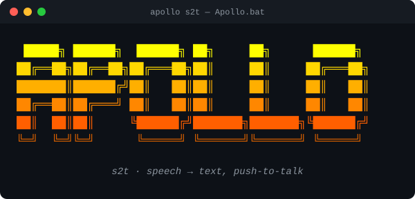

# Apollo s2t

<p align="center">
  
</p>

<p align="center">
  
  
  
  
</p>

**Tap a key, speak, tap again. Your words appear in the active text field.**

Windows 10/11 dictation for ChatGPT, VS Code, Word, browsers and other text fields.
One OpenRouter API key. No subscription to Apollo. MIT licensed.

## Install and run

Install [Python 3.10+](https://www.python.org/downloads/) with **Add Python to PATH**
and [Git](https://git-scm.com/downloads/win), then paste this into PowerShell:

```powershell
git clone https://github.com/perikx/apollo-s2t.git
cd apollo-s2t
.\Apollo.bat
```

The launcher installs dependencies, asks for your [OpenRouter API key](https://openrouter.ai/keys),
and starts Apollo in the system tray. The key is masked while entering it.
**Add credit to OpenRouter:** creating a key is free, but transcription and rewriting are paid API usage.

No Git? Use **Code → Download ZIP**, extract the folder, then double-click `Apollo.bat`.

## Use it

Click into a text field, **tap F8**, speak, then **tap F8 again**. The high tone means
recording started; the low tone means it stopped. Wait for the final text to appear.

| Key | Result |
| --- | --- |
| **F8** | Transcription only. |
| **F9** | Transcription with grammar and fillers cleaned up. Keeps the spoken language. |
| **F10** | A compact prompt for another AI. English output by default. |

Apollo inserts the complete result after recording, not word by word while speaking.
A second mode key does not interrupt an active recording. Stop it with the key that started it.
The default recording limit is five minutes; reaching it stops and processes the recording.

The microphone icon next to the clock has **settings, F10 profiles, autostart and Quit**.
Use `setup.bat` to reconfigure, or `debug.bat` to see diagnostic messages.
Quit the running copy and restart after changing settings.

## Defaults

| Stage | Model |
| --- | --- |
| Speech, including German and English | `microsoft/mai-transcribe-2` |
| F9/F10 text rewriting | `google/gemini-3.5-flash-lite` |

Speech language is detected automatically, including mixed-language dictation.
F9/F10 use minimal reasoning and latency-first provider routing. If rewriting fails,
returns empty text or is cut off, Apollo uses the original transcript instead.
Models remain configurable. See [configuration and model notes](docs/configuration.md).

## Update an existing installation

**Quit Apollo from its tray menu first**, then run these commands in your Apollo folder:

```powershell
git pull --ff-only
.\Apollo.bat
```

Dependencies are updated only when `requirements.txt` changes. Old shipped model defaults
are upgraded automatically, while your key, custom model choices, hotkeys and profiles are preserved.
The first configuration upgrade saves the old file as `config.json.bak`.
All speech uses OpenRouter. Setup has no speech-provider selector or live-typing option.

A downloaded ZIP or executable does not update itself when the repository changes.
For a ZIP installation, download the current source into a new folder and copy your
`config.json` and custom `prompts/` files before launching. Rebuild an older executable
with `packaging\build-exe.bat` to use the current program and setup.

## Check a problem

```powershell
.venv\Scripts\python.exe selftest.py
```

This checks configuration and audio settings **without making an API call or recording**.
For an explicit paid microphone → STT → rewrite smoke test:

```powershell
.venv\Scripts\python.exe selftest.py --live
```

For hotkey or paste problems, quit the tray copy and use `debug.bat`. Check Windows
microphone permissions and the selected input. Pasting into an elevated app can require
the same privilege level. API authentication, missing credit and invalid-model errors
have separate messages. Logs contain counts and timings, not dictated text.

## More

[Configuration, profiles and clipboard modes](docs/configuration.md) ·
[Contributing and tests](docs/development.md) · [Changelog](CHANGELOG.md)

Build a standalone Windows executable with `packaging\build-exe.bat`.
It opens a key-entry dialog on first launch. Python is not needed on the target PC.

## Privacy

Audio is kept in memory and sent to OpenRouter for transcription. F9/F10 additionally
send the transcript, and F10's selected project context, for rewriting. Provider data
policies apply. No Apollo telemetry. No local transcript/audio history is written.
Clipboard insertion necessarily makes the text available through the system clipboard.

`config.json` and its migration backup can contain an API key in plain text; both are
ignored by Git. Alternatively set `OPENROUTER_API_KEY` in your environment.
Do not share configuration files or commit private prompt profiles.

[MIT License](LICENSE) · [Report a problem](https://github.com/perikx/apollo-s2t/issues)
